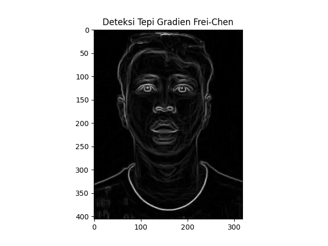

### Judul

**Perbandingan Kinerja Operator Gradien untuk Peningkatan Deteksi Tepi Citra Wajah**

### Penjelasan Singkat

Penelitian ini menyajikan dasar konsep pengolahan citra dengan fokus pada deteksi tepi, sebuah teknik analisis mutu citra yang krusial dalam pengolahan citra digital. Tujuan utama penelitian ini adalah meningkatkan kualitas citra wajah melalui perbandingan tiga operator gradien utama: Roberts, Prewitt, Frei-Chen dan Sobel. Deteksi tepi memiliki peranan penting dalam berbagai aplikasi pengolahan citra, termasuk pengenalan nomor mobil, segmentasi wajah, identifikasi wajah, pencocokan wajah, dan pengenalan tulisan.

### Metode & Metodologi

**Metode** penelitian yang digunakan dalam penelitian ini adalah penggunaan metode Roberts, Prewitt, Frei-Chen dan Sobel sebagai operator gradien untuk mendeteksi tepi pada citra wajah

**Tahapan penelitian** meliputi

1. **Studi Pustaka** : pengumpulan dasar-dasar teori dan informasi yang menunjang penelitian seperti metode-metode deteksi tepi pada citra
2. **Analisa Kebutuhan Sistem** : difokuskan pada kebutuhan sumber daya yang berkaitan dengan penelitian seperti sumber daya data, sumber daya perangkat keras, dan sumber daya perangkat lunak.,
3. **Perancangan Sistem** : Tahap ini menjelaskan sistem yang dibuat dan bagaimana cara pengimplementasiannya,
4. **Uji Coba Sistem dan Penarikan Kesimpulan** : Kesimpulan diambil berdasarkan ketepatan masing-masing metode dalam menghasilkan pendeteksian tepi dari inputan citra wajah yang sama.

### Dataset

Dataset diambil melalui Google Image terkait Artis Indonesia

### Referensi

https://citeseerx.ist.psu.edu/document?repid=rep1&type=pdf&doi=a53d39436e835eea6c929d165d629a56a0921751

### Gambar Pendukung

Tabel Perbandingan Beberapa Operator Deteksi Tepi

| Gambar Artis                  | Sobel                                 | Prewitt                                   | Roberts                                   | Frei-Chen                                    |
| ----------------------------- | ------------------------------------- | ----------------------------------------- | ----------------------------------------- | -------------------------------------------- |
|  |  |  |  |  |
|      |    |    |    |    |
|    |   |   |   |   |

### Evaluasi

Operator Sobel dan Prewitt memberikan hasil deteksi tepi yang baik untuk citra wajah. Kedua operator tersebut mampu menghasilkan kontur tepi yang tajam, meningkatkan kejelasan fitur wajah, dan relatif tahan terhadap noise. Di sisi lain, operator Roberts, meskipun sederhana, cenderung menghasilkan deteksi tepi yang kurang halus dan mungkin kurang efektif untuk citra wajah. Sementara itu, operator Frei-Chen menonjolkan kompleksitas struktur tepi, namun dapat memerlukan komputasi yang lebih tinggi. Oleh karena itu, pemilihan operator gradien sebaiknya didasarkan pada kebutuhan spesifik citra wajah dan prioritas antara kejelasan tepi, ketahanan terhadap noise, dan efisiensi komputasional.

